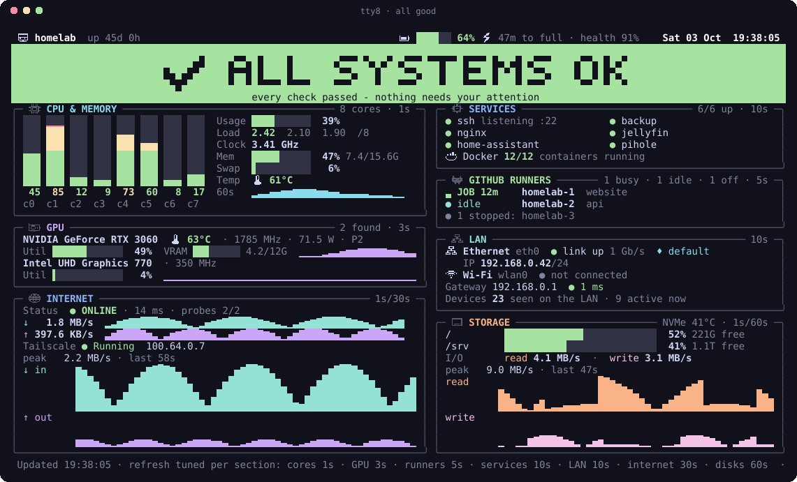
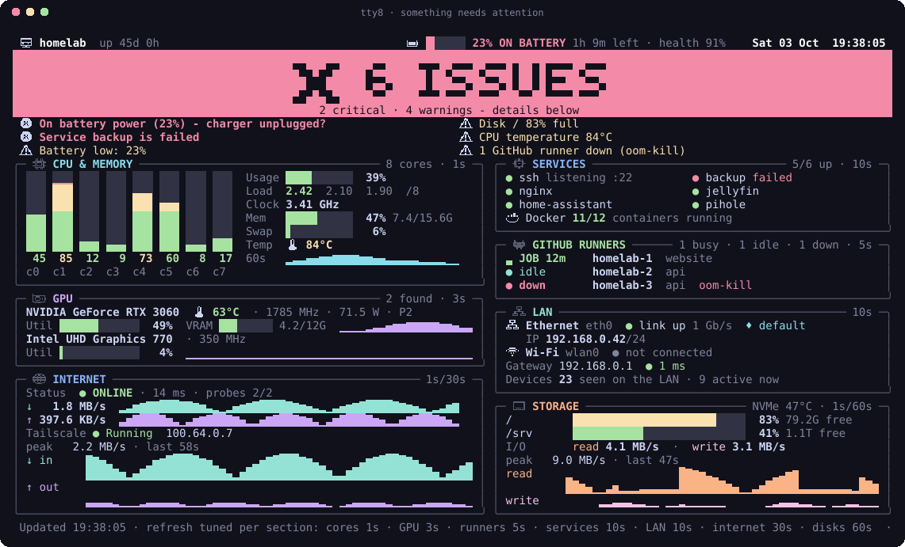

<div align="center">

# 🖥️ Server Glance

**Open the lid. Know if your server is OK.**

A status screen for the physical console of your home server, old laptop or headless box.
It starts at boot, shows up by itself when you open the lid or plug in a monitor, and puts a
big pixel-font banner on top, green or red, so you can tell from across the room.
No desktop and no browser, just the Linux console, with real icons.

[](https://github.com/saherkh4/server-glance/actions/workflows/ci.yml)


[](LICENSE)



</div>

---

## Why

Lots of us run a home server on an **old laptop** or a small box under the desk. When something
feels off, you open the lid and get… a login prompt. Then you log in, run `htop`, `df -h`,
`systemctl --failed`, `upower`, `docker ps`, `tailscale status`…

**Server Glance replaces all of that with one screen that's already waiting for you.**

<div align="center">

<br><sub>Charger unplugged? A service crashed? Disk filling up? You'll see it before you sit down.</sub>
</div>

## ✨ Features

| | |
| --- | --- |
| 🚦 **One-glance verdict** | A big pixel-font banner: green **ALL SYSTEMS OK**, yellow **WARNINGS**, or red **ISSUES**, with the issues listed under it, most serious first. |
| 🧠 **Per-core CPU** | A vertical bar for every core, coloured like a graphic equaliser (green, then yellow, then red as it fills), with load, clock, memory, swap, temperature and a 60-second usage history. |
| 🎮 **Every GPU** | NVIDIA (via `nvidia-smi`), Intel (busy %, worked out from RC6 power-saving residency, plus clocks) and AMD (busy %, VRAM, temp, power). Each gets a utilisation history. A power-managed laptop dGPU that's asleep is **left asleep**, not woken up to be polled. |
| 🐙 **GitHub Actions runners** | Self-hosted runners found automatically: which ones are **running a job, and for how long**, which are idle, which are down (with the reason, e.g. `oom-kill`), and which are stopped. |
| 🔗 **LAN** | Every physical NIC: Ethernet link and speed (warns about 10 Mb/s links and links with no IP), Wi-Fi SSID with signal bars and dBm, gateway round-trip time, and how many devices are visible on the LAN. |
| 🌐 **Internet** | Reachability and latency, live ↓/↑ throughput with charts, and Tailscale state. |
| 💾 **Storage** | Every real disk with smooth usage bars, NVMe temperature and live read/write charts. |
| ⚙️ **Services** | SSH, your own list of systemd units (user or system), anything **failed or restart-looping**, and Docker containers. |
| 🔋 **Battery, kept small** | One line in the header: charge, charging/discharging, time left and health. It turns red if the **charger is unplugged**. |
| 🎨 **Real icons on a text console** | At install time it builds a copy of your console font with **pixel-art icons and 1/8-cell bar glyphs**, and loads a soft colour palette on its own terminal only. In a normal terminal it uses emoji and true colour instead. |
| ⏱️ **Refresh tuned per section** | Each section updates as often as its data actually changes: cores every 1s, GPU 3s, runners 5s, services 10s, LAN 10s, internet 30s, disks 60s. Spare screen rows become charts. |
| 💤 **Polite when nobody's looking** | With the lid closed and no monitor attached, it stops drawing and polls less often, but keeps the history so the charts are full when you open the lid. |
| 👀 **Shows itself** | Opening the **lid** or plugging in an **HDMI/DP monitor** switches the console to the dashboard. |
| 🪶 **Tiny & safe** | One Python file, standard library only, about 15 MB of RAM. No browser, no X/Wayland, no web server, no open ports. Runs as your user, reads only, and never runs anything based on input. |

## 🚀 Quick start

```bash
git clone https://github.com/saherkh4/server-glance.git
cd server-glance

./glance.py --demo     # look at it right now, with sample data
./glance.py --once     # one real snapshot of this machine

sudo ./install.sh      # install it: starts on every boot, on tty8
```

That's it. Press **Ctrl+Alt+F8** to see it, or just close and reopen the lid.

> **Requirements:** Linux with systemd and Python 3.10+. Ubuntu Server 22.04+ and Debian 12+
> work out of the box. Optional tools improve what it can show: `docker`, `tailscale`,
> `networkctl`/`nmcli`/`iwgetid` for Wi-Fi names.

## 🧭 How it works

```
 boot ──► systemd ──► server-glance.service ──► full-screen dashboard on tty8 ──► console switches to tty8
                                                   │
          lid opened / monitor plugged in ◄────────┘ (checked every second) ──► switch back to tty8
```

- It runs on its **own virtual terminal** (tty8 by default), so your normal login on tty1
  stays where it is: **Ctrl+Alt+F1** for a shell, **Alt+F8** to come back.
- **The icon font:** `install.sh` copies your console font (Terminus 28×14 by default, so it's
  readable from a distance) and swaps about 50 rarely used accented glyphs (like `Ŧ` and `Ş`) for
  pixel-art icons and smooth block glyphs. It loads that font only on its own terminal; your other
  terminals keep the stock font.
- Data is collected by three background threads on per-source schedules, so a slow check
  (Docker, internet probes) never stalls the per-second CPU bars. Only changed lines are redrawn.
- It never crashes the screen. If a check fails, that panel shows "unavailable" or is
  hidden, and nothing gets made up.

## 🔧 Configuration

Optional. Put this in `~/.config/server-glance/config.json` for the user the service runs as,
or point `GLANCE_CONFIG` at a file.

```json
{
  "services": ["nginx", "docker", "home-assistant", "jellyfin"],
  "ignore_failed": ["^actions\\.runner\\."],
  "internet_probes": ["1.1.1.1:443", "8.8.8.8:53"]
}
```

| Key | What it does |
| --- | --- |
| `services` | Units shown in the Services panel. Each one is checked as a user unit and as a system unit, and the healthy one is shown. Units that are disabled on purpose are dimmed and don't raise an alarm. |
| `ignore_failed` | Regexes for failed units you don't want flagged. |
| `internet_probes` | `host:port` targets for plain TCP connects. No HTTP requests and no third-party "what's my IP" lookups. |
| `runners` | `true` (default) shows self-hosted GitHub Actions runners (`actions.runner.*.service`); `false` hides the panel. |

### Install options

```bash
sudo VT=9 ./install.sh                         # use tty9 instead
sudo FONT=Lat15-Terminus32x16 ./install.sh     # bigger or smaller font (see /usr/share/consolefonts)
sudo GLANCE_USER=alice ./install.sh            # run as a different user
sudo ./install.sh --uninstall                  # remove everything
```

## 🚦 What counts as a problem

| Check | ⚠️ Warning | ❌ Critical |
| --- | --- | --- |
| Power | running on battery, battery < 30%, health < 60% | battery < 15%, or on battery under 30% |
| Disk (any) | ≥ 80% | ≥ 90% |
| Memory | ≥ 85% | ≥ 92% |
| Swap | ≥ 80% | |
| Temperature | ≥ 80 °C | ≥ 90 °C |
| Load (5 min) | > 1.5 × CPU cores | |
| Watched services | | enabled but not running |
| Other systemd units | failed or restart-looping | |
| SSH | | not listening on :22 |
| GitHub runners | any runner down (grouped into one line, with the reason) | |
| GPU | temp ≥ 85 °C, VRAM ≥ 95% | temp ≥ 92 °C |
| LAN | Ethernet below 100 Mb/s, link with no IP, Wi-Fi signal < 30% | gateway not answering / no route |
| Internet | some probes fail | all probes fail |
| Tailscale | not `Running` | |
| Docker | unhealthy or restarting containers, daemon down | |

## 🔒 Security & privacy

- **Nothing is exposed to the network.** There's no web server and no listening port. The
  information only appears on the physical screen.
- Runs as an **unprivileged user** with `NoNewPrivileges`. The only extra capability is
  `CAP_SYS_TTY_CONFIG`, which it needs to switch the console to its own terminal.
- Read-only: it reads `/proc` and `/sys` and runs a fixed set of commands (`systemctl`,
  `df`, `ip`, `ss`, `docker`, `tailscale`, `journalctl`) with timeouts. It never builds a command
  from untrusted input.
- The only outbound traffic is the TCP connects you configure in `internet_probes`, plus a TCP
  handshake to your own gateway for the LAN check. That needs no privileges; a hardened service
  can't use `ping`.
- The custom font is generated on your machine from your own console font; no font files are
  downloaded or shipped.
- Keep in mind that anyone who can see the screen can see what's on it (IP addresses, service
  names). That's the point, but think about where the screen is.

## 🛠️ Troubleshooting

```bash
systemctl status server-glance        # is it running?
journalctl -u server-glance -e        # logs
sudo chvt 8                           # jump to the dashboard from SSH
./glance.py --json                    # see exactly what it collected
```

- **Lid opens but the screen stays black.** Make sure the system doesn't suspend on lid close.
  Set `HandleLidSwitch=ignore` in `/etc/systemd/logind.conf`, which is usual for laptop servers.
- **Screen goes blank after a while.** Add `consoleblank=0` to the kernel command line.
- **Squares instead of icons.** The icon font couldn't be built from your `FONT=`; the installer
  says so and falls back to plain glyphs. Use one of the `Lat15-Terminus*` fonts.
- **Take a real screenshot of the console:**
  `sudo python3 tools/capture_console.py 8 /usr/local/lib/server-glance/glance.psf shot.png`

## 🧪 Development

```bash
python3 -m unittest discover -s tests -v   # tests
./glance.py --demo                         # live sample data, works on any machine
python3 tools/screenshot.py                # regenerate docs/*.svg
```

PRs are welcome. Please keep it to **one file with zero dependencies**.
Ideas: SMART disk health, UPS (NUT) status, ZFS/RAID state, top processes, a QR code that
links to your dashboard, and more languages.

## 📄 License

[MIT](LICENSE). Use it, fork it, and put it on your server.
